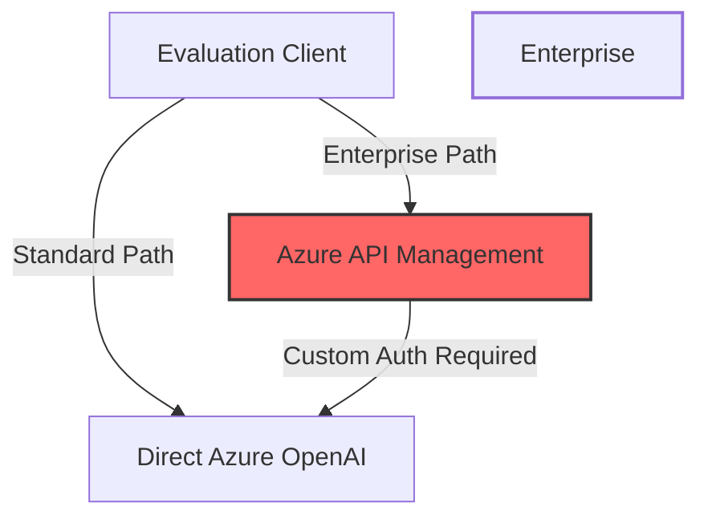

Learn how to implement robust evaluation for AI agents using Azure AI Evaluation SDK when working with Azure API Management (APIM), overcoming authentication and integration challenges.


{/* truncate */}

# Building Reliable AI Agents: Implementing Advanced Evaluation with Azure AI SDK and Custom APIM Integration

In enterprise environments, evaluating the performance of AI agents is crucial for ensuring quality, reliability, and compliance. Microsoft's Azure AI Evaluation SDK provides powerful tools for this purpose—but what happens when your AI services are accessed through Azure API Management (APIM) with custom authentication requirements? This post details our journey implementing a robust evaluation system for an AI research agent deployed behind APIM, sharing solutions to challenges that aren't covered in the standard documentation.

## The Evaluation Challenge: Beyond Standard Setups

While Azure AI Evaluation SDK works seamlessly with direct Azure OpenAI endpoints, enterprise deployments often route API calls through Azure API Management (APIM) to:

1. **Enforce Security Policies**: Custom authentication, rate limiting, IP filtering
2. **Add Business Logic**: Request transformation, logging, monitoring
3. **Manage Multiple Services**: Unified access point across various AI services

This architectural choice creates significant challenges when trying to use standard evaluation tools:



Our research agent required evaluation across multiple metrics, including:
- Groundedness (factual accuracy)
- Answer relevancy
- Contextual precision and recall
- Faithfulness to sources
- Fluency and coherence

## The APIM Roadblock

The standard evaluators from Azure AI Evaluation SDK failed when pointed at our APIM endpoint due to:

1. **Authentication Failure**: Azure AD token authentication wasn't being properly passed through
2. **Missing Headers**: Required custom headers (`mkl-User-name`, `username`) weren't included
3. **Incompatible Response Handling**: APIM response transformations broke evaluator expectations

Here's what a typical failure looked like:

```python
# Standard approach - fails with APIM
evaluators = {
    "groundedness": GroundednessEvaluator(),
    "relevance": RelevanceEvaluator()
}

results = evaluate(
    evaluators=evaluators,
    target_function=run_research_agent,
    test_cases=test_scenarios,
    # Even when providing correct APIM URL, it fails with auth errors
    azure_endpoint=os.getenv("AZURE_APIM_URI")
)
```

This would consistently result in `401 Unauthorized` or `403 Forbidden` errors, even when environment variables for authentication were correctly set.

## Solution Part 1: Custom APIM-Aware Evaluators

Our first step was to create custom evaluator classes that could handle the APIM authentication and header requirements:

```python
class APIMEvaluatorBase:
    """Base class for custom APIM-compatible evaluators."""
    
    def __init__(self, metric_name, apim_config):
        self._metric_name = metric_name
        self.config = apim_config
        
        # Get OpenAI client with proper auth for APIM
        self.client = self._create_apim_client()
    
    def _create_apim_client(self):
        # Get Azure AD token
        credential = DefaultAzureCredential()
        token = credential.get_token("https://cognitiveservices.azure.com/.default")
        
        # Create client with custom headers for APIM
        client = AzureOpenAI(
            azure_endpoint=self.config.endpoint,
            api_version=self.config.api_version,
            api_key=token.token,  # Using token as API key
        )
        
        # Add required APIM headers
        headers = {
            "mkl-User-name": self.config.username,
            "username": self.config.username
        }
        
        # Apply headers to all requests
        client = client.with_additional_headers(headers)
        return client
        
    def __call__(self, response, context=None, query=None):
        """Evaluate with our APIM-aware client."""
        # Implementation depends on specific metric
        raise NotImplementedError()
```

We then created specific subclasses for each evaluation metric:

```python
class APIMGroundednessEvaluator(APIMEvaluatorBase):
    """Evaluates groundedness using APIM-compatible client."""
    
    _metric_name = "groundedness"
    
    def __init__(self, apim_config):
        super().__init__(self._metric_name, apim_config)
    
    def __call__(self, response, context=None, query=None):
        """
        Evaluates if the response is grounded in the provided context.
        """
        prompt = f"""
        You are evaluating the factual accuracy of an AI assistant's response.
        
        Query: {query}
        
        Context (ground truth):
        {context}
        
        Response to evaluate:
        {response}
        
        Evaluate whether the response contains only information that is present in the context.
        
        Score from 0-5, where:
        0: Completely ungrounded, containing major hallucinations
        1: Mostly ungrounded with several inaccuracies
        2: Partially grounded, but with notable inaccuracies
        3: Mostly grounded with minor inaccuracies
        4: Almost completely grounded, with very minor inaccuracies
        5: Completely grounded, only containing information from the context
        
        Format your response as a JSON object with the following keys:
        - score: The numerical score (0-5)
        - reasoning: Your step-by-step evaluation
        """
        
        try:
            # Call Azure OpenAI via APIM with our authenticated client
            response = self.client.chat.completions.create(
                model=self.config.deployment_name,
                messages=[{"role": "user", "content": prompt}],
                temperature=0.0,
                response_format={"type": "json_object"}
            )
            
            # Parse JSON response
            content = response.choices[0].message.content
            result = json.loads(content)
            
            # Return properly formatted result
            return {
                "score": result["score"],
                "reasoning": result["reasoning"]
            }
            
        except Exception as e:
            logger.error(f"Error evaluating groundedness: {e}")
            return {"score": 0, "reasoning": f"Evaluation failed: {str(e)}"}
```

We implemented similar classes for the other metrics: `APIMRelevanceEvaluator`, `APIMContextualPrecisionEvaluator`, etc.

## Solution Part 2: The Manual Evaluation Loop

While our custom evaluators solved the authentication and header issues, we encountered an unexpected problem when trying to use them with the SDK's `evaluate()` function. Even though our individual evaluators worked correctly, the evaluation framework couldn't properly aggregate their results.

After extensive debugging, we found that the SDK's `evaluate()` function has limitations when handling custom evaluators that use direct API calls with custom authentication. The inner workings of the function assume certain behavior that our APIM-aware evaluators couldn't satisfy.

Our solution was to implement a manual evaluation loop:

```python
def run_manual_evaluation(test_scenarios, apim_config):
    """Run evaluation manually with custom APIM-aware evaluators."""
    
    # Initialize our custom evaluators
    evaluators = {
        "groundedness": APIMGroundednessEvaluator(apim_config),
        "relevance": APIMRelevanceEvaluator(apim_config),
        "contextual_precision": APIMContextualPrecisionEvaluator(apim_config),
        "faithfulness": APIMFaithfulnessEvaluator(apim_config),
        "fluency": APIMFluencyEvaluator(apim_config)
    }
    
    # Define threshold for each metric
    thresholds = {
        "groundedness": 3.5,
        "relevance": 3.5,
        "contextual_precision": 3.0,
        "faithfulness": 3.5,
        "fluency": 3.0
    }
    
    # Store results for each scenario and metric
    all_results = []
    
    # Process each test scenario
    for scenario in test_scenarios:
        # Run the agent to get a response
        agent_response = run_research_agent(
            query=scenario["query"],
            additional_context=scenario.get("additional_context", "")
        )
        
        # Evaluate with each metric
        scenario_results = {
            "query": scenario["query"],
            "response": agent_response,
            "metrics": {}
        }
        
        for metric_name, evaluator in evaluators.items():
            # Skip metrics not required for this scenario
            if metric_name not in scenario.get("evaluation_metrics", list(evaluators.keys())):
                continue
                
            # Run evaluation
            result = evaluator(
                response=agent_response,
                context=scenario.get("context", ""),
                query=scenario["query"]
            )
            
            # Store result
            scenario_results["metrics"][metric_name] = {
                "score": result["score"],
                "reasoning": result["reasoning"],
                "threshold": thresholds[metric_name],
                "pass": result["score"] >= thresholds[metric_name]
            }
        
        all_results.append(scenario_results)
    
    # Calculate overall metrics
    summary = calculate_evaluation_summary(all_results, thresholds)
    
    # Save results to file
    save_evaluation_results(all_results, summary)
    
    return all_results, summary
```

This manual approach gave us complete control over the evaluation process, while still using the custom evaluators we created to interface with APIM.

## Key Metrics in Practice

Let's look at how some of the key metrics worked in real-world evaluation of our research agent:

### Groundedness Evaluation

Groundedness measures whether the AI's response contains information that's supported by the provided context:

```python
# Example scenario with groundedness evaluation
scenario = {
    "query": "What are the main environmental risks for offshore drilling?",
    "context": "Offshore drilling poses several environmental risks including: 
               oil spills that can damage marine ecosystems, 
               disruption of marine habitats during drilling, 
               underwater noise pollution affecting marine mammals, 
               and greenhouse gas emissions from flaring operations.",
    "evaluation_metrics": ["groundedness", "relevance"]
}

# Agent response
response = "Offshore drilling presents significant environmental concerns. 
            The primary risks include catastrophic oil spills that damage marine ecosystems,
            physical disruption of seafloor habitats during drilling operations,
            noise pollution that can disorient and harm marine mammals like whales and dolphins,
            and substantial greenhouse gas emissions from gas flaring."

# Evaluator assessment (simplified)
result = {
    "score": 5.0,  # Perfect score - all information is grounded
    "reasoning": "The response accurately reflects all environmental risks mentioned 
                 in the context without adding unsupported claims."
}
```

### Relevance Evaluation

Relevance assesses how well the response addresses the specific query:

```python
# Example with lower relevance score
scenario = {
    "query": "What regulations govern offshore drilling safety?",
    "context": "Offshore drilling is regulated by several frameworks including 
               the BSEE regulations in the US, which mandate safety equipment like blowout preventers. 
               The SEMS rule requires safety management systems. 
               International operations often follow IMO guidelines and regional regulations."
}

# Less relevant response
response = "Offshore drilling has strict regulations. Companies must follow 
            environmental protection standards and obtain permits before drilling. 
            Environmental impact assessments are required in many jurisdictions."

# Evaluator assessment
result = {
    "score": 2.0,  # Low score - response doesn't address safety regulations specifically
    "reasoning": "The response discusses regulations but focuses on environmental permits
                 rather than the safety regulations mentioned in the context. 
                 It doesn't address BSEE, SEMS, or IMO guidelines specifically asked about in the query."
}
```

## Implementation Insights

During our implementation, we discovered several important insights:

### 1. TypedDict for Response Typing

Azure AI Evaluation expects specific return types from evaluator `__call__` methods. Using Python's `TypedDict` ensures compatibility:

```python
from typing import TypedDict, List, Dict

class GroundednessResult(TypedDict):
    score: float
    reasoning: str

class APIMGroundednessEvaluator(APIMEvaluatorBase):
    # ...
    def __call__(self, response, context=None, query=None) -> GroundednessResult:
        # Implementation
        # ...
```

### 2. Error Handling for API Stability

Our APIM calls occasionally encountered timeout or transient errors. Adding robust error handling improved stability:

```python
def safe_api_call(client, *args, max_retries=3, **kwargs):
    """Make API call with retry logic."""
    for attempt in range(max_retries):
        try:
            return client.chat.completions.create(*args, **kwargs)
        except (APITimeoutError, ServiceUnavailableError) as e:
            if attempt == max_retries - 1:
                raise
            time.sleep(2 ** attempt)  # Exponential backoff
```

### 3. Caching for Performance

Evaluation can be time-consuming and expensive. We implemented caching to avoid redundant API calls:

```python
class CachingEvaluator:
    """Wrapper for evaluators that caches results."""
    
    def __init__(self, evaluator, cache_file=None):
        self.evaluator = evaluator
        self.cache_file = cache_file or f"{type(evaluator).__name__}_cache.json"
        self.cache = self._load_cache()
    
    def _load_cache(self):
        if os.path.exists(self.cache_file):
            with open(self.cache_file, 'r') as f:
                return json.load(f)
        return {}
    
    def _save_cache(self):
        with open(self.cache_file, 'w') as f:
            json.dump(self.cache, f)
    
    def __call__(self, response, context=None, query=None):
        # Create cache key from inputs
        key = hashlib.md5(f"{query}|{context}|{response}".encode()).hexdigest()
        
        if key in self.cache:
            return self.cache[key]
        
        # Call underlying evaluator
        result = self.evaluator(response, context, query)
        
        # Cache result
        self.cache[key] = result
        self._save_cache()
        
        return result
```

## Lessons Learned and Recommendations

Based on our experience, here are key recommendations for implementing evaluation with APIM:

### For Microsoft

1. **Better APIM Documentation**: Add specific guidance for using evaluation tools with APIM-protected endpoints.
2. **Authentication Flexibility**: Enhance the SDK to support Azure AD token auth and custom headers.
3. **Extension Points**: Provide clearer hooks for extending evaluators with custom authentication.

### For Developers

1. **Start Simple**: Test individual evaluator classes before attempting to use the full evaluate() framework.
2. **Error Logging**: Implement verbose logging for evaluation failures to identify auth/header issues.
3. **Manual Control**: Don't hesitate to implement your own evaluation loop for complex scenarios.
4. **Test Environment**: Create a test environment without APIM to validate evaluation logic before adding APIM complexity.

## Example Evaluation Results

We ran our custom evaluation system against a research agent tasked with investigating various companies. Here's a sample of the results:

```json
{
  "summary": {
    "groundedness": {
      "average_score": 4.7,
      "pass_rate": 0.95,
      "threshold": 3.5
    },
    "relevance": {
      "average_score": 4.5,
      "pass_rate": 0.92,
      "threshold": 3.5
    },
    "contextual_precision": {
      "average_score": 4.2,
      "pass_rate": 0.89,
      "threshold": 3.0
    },
    "faithfulness": {
      "average_score": 4.6,
      "pass_rate": 0.94,
      "threshold": 3.5
    },
    "fluency": {
      "average_score": 4.8,
      "pass_rate": 0.98,
      "threshold": 3.0
    },
    "overall_pass_rate": 0.91
  }
}
```

These results helped identify weaknesses in our agent and guided improvements to the prompts, retrieval strategies, and overall system design.

## Conclusion

Implementing advanced evaluation for AI agents in an enterprise environment with APIM presents unique challenges, but the effort is worthwhile. Our custom APIM-aware evaluators and manual evaluation loop provided comprehensive quality assessment capabilities while working within the constraints of our enterprise architecture.

By sharing our approach, challenges, and solutions, we hope to help others implement robust evaluation systems for their AI agents, even when the standard tools don't fit perfectly with their enterprise architecture.

The quality of AI systems depends not just on their capabilities, but on our ability to reliably measure their performance. With the right evaluation approach, we can build AI agents that are not only powerful but trustworthy and reliable in enterprise contexts. 