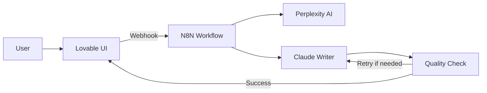

I used to spend 6+ hours writing Analysis of Alternatives reports. Last week, I built an AI agent that does it in minutes - and you can too, without writing complex code.


## The $10,000 Analysis Problem

Every time a client needed an Analysis of Alternatives (AOA) report, I'd block out an entire day. Research competitors, analyze features, evaluate pricing models, compile citations - it was a necessary but exhausting process. At my consulting rate, each report effectively cost thousands of dollars in time.

Then it hit me at 2 AM during yet another report marathon: What if an AI could handle the research and compilation, while I focused on strategy and insights?

## What We're Building Today

Before diving into the how, let me show you what's possible. I built an agent that:

- **Researches any topic** using Perplexity AI's real-time web search
- **Writes comprehensive reports** with 15-30 citations for deep research
- **Self-evaluates and improves** through an automated feedback loop
- **Delivers in minutes** what used to take hours

**[Try the live demo here →](https://aoa.jonroosevelt.com/)**
**[Watch tutorial →](https://www.loom.com/share/d0d05614c00447f79b2fc6f5edb2a6cf)**

The agent offers two modes:
- **Pro Mode**: 2-4 minute reports with 5 citations (perfect for quick comparisons)
- **Deep Research Mode**: 10+ minute reports with 15-30 citations (for thorough analysis)

Here's where it gets interesting - I built this entire system in a matter of hours using visual tools, not months of coding.

## The No-Code Stack That Makes It Magic

### Meet Your New Best Friends

**[Lovable](https://lovable.dev)** - Your AI UI Assistant
- Transforms ideas into working interfaces through chat
- No React knowledge needed (though it helps)
- Handles all the complex frontend setup
- Free tier available to get started

**[N8N](https://n8n.io)** - The Workflow Wizard
- Visual workflow automation that actually makes sense
- Connects to any API without code
- Self-hostable (I run mine on a VPS)
- Think Zapier, but with superpowers

The magic happens when these two tools work together. Lovable creates the user interface, N8N handles the AI orchestration, and they communicate through a simple webhook.



## Part 1: Creating the UI with Lovable

Getting started with Lovable takes literally 30 seconds. Here's how I built the search interface:

### Step 1: The Initial Prompt

I started with this simple request:
```
Create a search interface with two modes:
- Pro mode (2-4 minutes)
- Deep Research mode (10+ minutes)
Include a text input for the search query and a search button.
```

Lovable immediately generated a clean React interface. But here's the clever part...

### Step 2: Adding the API Connection

The real magic happens when you connect to your backend:

```javascript
// Lovable generated this for me
const handleSearch = async () => {
  const response = await fetch('https://your-n8n-webhook-url/aoa', {
    method: 'POST',
    headers: { 'Content-Type': 'application/json' },
    body: JSON.stringify({
      task: searchQuery,
      mode: searchMode
    })
  });
  
  const data = await response.json();
  setReport(data.report);
};
```

### Step 3: Making It Beautiful

Lovable's AI understands design principles. I simply asked:
```
Make this look professional with a modern gradient background 
and smooth animations when the report loads
```

Within minutes, I had a polished interface that looked like it took weeks to build.

## Part 2: Building the Brain with N8N

This is where your agent gets its intelligence. N8N's visual interface makes complex workflows surprisingly intuitive.

### The Workflow Architecture


Here's how the workflow processes each request:

1. **Webhook Trigger**: Receives the search query from Lovable
2. **Mode Branch**: Routes to different prompts based on Pro/Deep mode
3. **Perplexity Research**: Performs web research with citations
4. **Report Writing**: Claude crafts the analysis
5. **Quality Evaluation**: Checks if the report meets standards
6. **Retry Logic**: Improves the report if needed

### The Research Phase

The Perplexity integration is straightforward but powerful:

```javascript
// N8N expression in the Perplexity node
{
  "model": "sonar",
  "messages": [{
    "role": "user",
    "content": `Write a thorough report on: ${json.body.task}`
  }]
}
```

### Smart Prompt Engineering

For Deep Research mode, I provide extensive instructions:

```xml
<instructions>
Write an Analysis of Alternatives report with:
- Length: 4000-5000 words
- Citations: 15-30 sources
- Sections: Executive Summary, Evaluation Criteria, 
  Detailed Analysis, Recommendations
</instructions>

<example>
[One-shot example of a high-quality report]
</example>
```

This XML structure (following OpenAI's latest guidelines) ensures consistent, high-quality output.

## Part 3: The Secret Sauce - Quality Control Loop

Here's what sets this agent apart - it doesn't just generate content, it critiques and improves it.

### The Evaluator Pattern

After generating a report, the workflow runs it through an evaluator:

```javascript
// Simplified evaluation logic
const evaluationCriteria = {
  hasExecutiveSummary: true,
  citationCount: mode === 'deep' ? 15 : 5,
  wordCount: mode === 'deep' ? 4000 : 1000,
  sectionsComplete: true
};

if (!meetsAllCriteria) {
  // Retry with specific feedback
  return retryWithFeedback(evaluation.rationale);
}
```

### The Retry Mechanism

If the report doesn't meet standards, the agent:
1. Captures the evaluator's feedback
2. Adds it to the prompt: "Your previous attempt failed because..."
3. Regenerates with improvements
4. Limits retries to 5 attempts to prevent infinite loops

This self-improvement loop typically produces excellent results within 1-2 iterations.

### Performance Optimization

To keep costs down and speed up development:

```javascript
// Pin successful outputs during testing
if (testMode) {
  saveOutput(perplexityResult);
  return pinnedOutput; // Skip API call
}
```

This "pinned data" approach saved me hundreds of dollars during development.

## Deploy Your Own in 5 Minutes

Ready to build your own AI agent? Here's your quickstart guide:

### Requirements Checklist
- [ ] Lovable account (free tier works)
- [ ] N8N instance (cloud or self-hosted)
- [ ] Perplexity API key ($5 gets you started)
- [ ] OpenRouter account for Claude access

### Quick Deployment Steps

1. **Clone the Lovable template**:
   - Start a new Lovable project
   - Copy the UI code from my examples
   - Update the webhook URL

2. **Import the N8N workflow**:
   - Download the [workflow template](https://github.com/yourusername/aoa-agent)
   - Import into your N8N instance
   - Add your API keys

3. **Configure the connection**:
   ```javascript
   // In Lovable, update this line:
   const WEBHOOK_URL = 'https://your-n8n-domain.com/webhook/aoa';
   ```

4. **Test with a simple query**:
   - Try: "Compare the best CRM tools for small businesses"
   - You should see results in 2-4 minutes

5. **Customize for your needs**:
   - Adjust the prompt templates
   - Modify evaluation criteria
   - Add your own examples

### Common Customizations

**For Legal/Compliance Reports**:
- Add regulatory citation requirements
- Include risk assessment sections
- Enforce specific formatting standards

**For Technical Comparisons**:
- Emphasize performance metrics
- Add code examples
- Include architecture diagrams

**For Business Analysis**:
- Focus on ROI calculations
- Add market size data
- Include competitor pricing

## What's Next?

This agent is just the beginning. Here are some enhancements you could add:

### Enhancement Ideas
- **Multi-language support**: Translate reports automatically
- **PDF generation**: Export polished documents
- **Team collaboration**: Share and edit reports
- **Historical tracking**: Compare analyses over time
- **Custom templates**: Industry-specific formats

### Join the Community

Building AI agents shouldn't be a solo journey:
- **[Lovable Discord](https://discord.gg/lovable)**: Get UI help and share creations
- **[N8N Community](https://community.n8n.io)**: Find workflows and troubleshooting
- **[My GitHub](https://github.com/RooseveltAdvisors)**: Access the full source code

### Resources to Level Up
- **[Loom Video Tutorial](https://www.loom.com/share/d0d05614c00447f79b2fc6f5edb2a6cf)**: Watch me build this step-by-step
- **[Perplexity API Docs](https://docs.perplexity.ai)**: Master advanced search features
- **[Prompt Engineering Guide](https://platform.openai.com/docs/guides/prompt-engineering)**: Write better AI instructions

## Your Turn

The best part about this approach? You can build your own specialized agent this weekend. Whether it's market research, technical documentation, or competitive analysis, the pattern remains the same:

1. **Design** a simple UI with Lovable
2. **Build** the logic flow in N8N  
3. **Connect** to AI services
4. **Iterate** based on results

Stop spending days on repetitive analysis. Start building agents that work while you sleep.

**Ready to begin? [Try the live demo](https://aoa.jonroosevelt.com/) and see what's possible.**

---

*Have questions or want to share what you built? [Find me on LinkedIn](https://linkedin.com/in/jon-roosevelt) or [visit my website](https://jonroosevelt.com). I'd love to see your AI agents in action!* 