After spending months helping enterprises build AI systems, I noticed a pattern: everyone wanted powerful RAG capabilities, but few were comfortable shipping their proprietary data to external APIs. The cost? Predictable. The compliance story? Simple. But the control and security? Gone.

So I asked myself: could we build something that matches GraphRAG and Nano-GraphRAG performance using entirely local, self-hosted components?

The answer surprised me. Not only is it possible—it's practical, cost-effective, and production-ready. Here's what I learned building a complete Graph RAG system with Phi-4 and LightRAG.

<!--truncate-->

## Why Local SLMs + Graph RAG Matter Now

Let me cut straight to what matters: cost, control, and compliance.

### The Real Cost Story

I ran the numbers for a typical enterprise knowledge base—about 50,000 documents, 1,000 queries per day. Here's what I found:

**OpenAI API approach:**
- GPT-4 for entity extraction: ~$1,500/month
- GPT-4 for query responses: ~$800/month
- Embedding API: ~$200/month
- Vector database (Pinecone): ~$300/month
- Graph database (Neo4j Aura): ~$500/month
- **Total: $3,300/month or $39,600/year**

**Self-hosted with Phi-4:**
- All infrastructure on AWS: ~$2,220/month or $26,640/year
- **Annual savings: $12,960 (33% reduction)**

Or go fully on-premise with a GPU server (~$6,000 upfront) and you're looking at $2,300/year in operating costs. Break-even in 2.3 months.

But cost isn't the whole story.

### Data Sovereignty Changes Everything

If you're in healthcare, finance, or any regulated industry, you know the drill. Every vendor that touches your data needs:
- Business Associate Agreements (HIPAA)
- Data Processing Agreements (GDPR)
- SOC 2 audits
- Regular security reviews
- Incident response coordination

With a self-hosted system? Your data never leaves your infrastructure. The compliance story becomes: "We don't send data anywhere." Done.

### Performance at Your Pace

No rate limits. No surprise throttling during usage spikes. No waiting on API quota increases.

You control the throughput. You optimize for your workload. You scale when ready.

## Architecture Deep Dive

Let me show you what we're building:


### Why Four Storage Systems?

When I first looked at LightRAG, I thought "surely we don't need ALL of these." I tried running it with just PostgreSQL. Failed. Tried with just Neo4j. Failed.

Turns out, each storage system has a specific job:

**PostgreSQL with pgvector** handles three critical tasks:
- Vector embeddings for similarity search
- Key-value storage for document metadata
- Document processing status tracking

**Neo4j** stores the knowledge graph—the relationships between entities that make Graph RAG powerful. This is where the magic happens: multi-hop reasoning, entity deduplication, and relationship inference.

**Redis** caches LLM responses. When Phi-4 takes 2-3 seconds to extract entities from a document, you don't want to do it twice. Redis cut my processing time by 60% on repeated operations.

**Phi-4 via Ollama** is your local LLM. 14 billion parameters, 128K context window (if you configure it right—more on that later), and it runs entirely on your hardware.

### LightRAG: The Secret Sauce

LightRAG isn't just another RAG framework. It's specifically designed for graph-based RAG with:

- **Multi-hop reasoning**: "What technologies does our healthcare platform use and what security measures protect patient data?" requires jumping across multiple entity relationships.

- **Entity deduplication**: "AWS Lambda," "Lambda functions," and "λ" all refer to the same thing. LightRAG figures this out.

- **Hybrid query modes**: Choose between local search (specific entities), global search (broad patterns), or mix both for comprehensive answers.

- **Document status tracking**: Production systems fail. Documents get corrupted. APIs time out. LightRAG tracks every document's processing state with built-in retry capability.

## Two Deployment Paths

I've deployed this system both ways. Here's what you need to know about each.

### Path 1: Local Linux Machine (Budget-Friendly)

This is my development setup. One beefy Linux box in the corner of my office.

**Hardware requirements:**

*Minimum viable (you can actually run this):*
- CPU: 16 cores
- RAM: 64GB
- GPU: RTX 4090 (24GB VRAM)
- Storage: 500GB NVMe SSD
- Cost: ~$3,000-4,000

*Recommended (smooth experience):*
- CPU: 24-32 cores
- RAM: 128GB
- GPU: A6000 (48GB VRAM) or dual RTX 4090
- Storage: 1TB NVMe SSD
- Cost: ~$6,000-8,000

**Monthly operating cost:** $50-150 (mostly electricity)

The beauty? After that initial hardware investment, you're essentially running free. No per-token charges. No usage-based billing surprises.

### Path 2: AWS Cloud-Native Architecture

For production deployments, I recommend AWS. Here's the architecture:


Here's the service mapping:

```yaml
Component          Local                  AWS Service
─────────────────  ───────────────────    ─────────────────────────
PostgreSQL         Docker Container        RDS for PostgreSQL
Neo4j              Docker Container        EC2 + EBS (Neo4j)
Redis              Docker Container        ElastiCache for Redis
Phi-4 LLM          Ollama on GPU          EC2 G5 instance
LightRAG App       Docker Container        ECS Fargate / EC2
Storage            Local disk             EFS / S3
```

**Why these specific choices?**

**RDS for PostgreSQL** gives you managed backups, automated patching, and Multi-AZ high availability. Yes, it costs more than self-managed (~$280-560/month vs ~$100-200/month), but the operational overhead savings are worth it.

**Neo4j on EC2** because there's no managed Neo4j on AWS yet. I use r6i.2xlarge (8 vCPU, 64GB RAM, ~$400/month) with gp3 EBS volumes. Reserved instances cut this to ~$300/month.

**ElastiCache for Redis** (~$150-280/month) handles failover automatically. Better than self-managed for production.

**EC2 G5 for Phi-4** is the interesting one. g5.2xlarge gives you 24GB GPU, enough for Phi-4. At $1.20/hour, that's ~$900/month for 24/7 operation. But here's the trick: use Spot Instances during development for 60-70% savings. Run it only during business hours in dev environments (~$200-400/month).

**AWS Cost Reality Check:**

Development/testing: ~$870/month
- RDS PostgreSQL: $280
- EC2 Neo4j: $200
- ElastiCache Redis: $150
- EC2 G5 (Spot, 8h/day): $100
- ECS Fargate: $60
- Storage: $50
- Data Transfer: $30

Production 24/7: ~$2,220/month
- RDS PostgreSQL Multi-AZ: $560
- EC2 Neo4j Reserved: $300
- ElastiCache Redis HA: $280
- EC2 G5 Reserved: $650
- ECS Fargate HA: $180
- Infrastructure: $250

Still 33% cheaper than the OpenAI API approach.

## What I Learned (The Hard Way)

Let me save you some pain.

### Lesson 1: Git History and Upstream Syncing

I forked the LightRAG repository to customize my docker-compose setup. Everything worked great until I wanted to pull upstream updates.

`git merge upstream/main` failed spectacularly: "refusing to merge unrelated histories."

The problem? I'd made too many custom changes. The solution wasn't pretty:

```bash
# Always backup before destructive operations
git branch backup-main-$(date +%Y%m%d)

# Hard reset to upstream (scary but necessary)
git reset --hard upstream/main

# Cherry-pick your custom configs back
git checkout backup-branch -- docker-compose.yml
git checkout backup-branch -- .env
```

**Lesson learned:** Keep your customizations in separate override files. LightRAG supports `docker-compose.override.yml` for exactly this reason.

### Lesson 2: Docker Service Dependencies Matter

My first deployment kept failing with cryptic DNS resolution errors. The LightRAG container would start, try to connect to PostgreSQL, and fail—even though PostgreSQL was "running."

The issue? Service start order. PostgreSQL takes 10-15 seconds to actually become ready. LightRAG was trying to connect after 2 seconds.

The fix:

```yaml
services:
  lightrag:
    depends_on:
      postgres:
        condition: service_healthy
      neo4j:
        condition: service_healthy
      redis:
        condition: service_healthy

  postgres:
    healthcheck:
      test: ["CMD-SHELL", "pg_isready -U postgres"]
      interval: 5s
      timeout: 5s
      retries: 5
```

Now services wait for actual health, not just "started."

### Lesson 3: Phi-4 Context Window Configuration

This one cost me hours of debugging.

LightRAG needs at least 32K context window to work properly. Default Ollama models? 8K context.

I kept getting errors like "context length exceeded" during entity extraction. The documents weren't even that long—maybe 5,000 words.

The problem? Phi-4's system prompt, the document text, AND the structured output schema all fit in that context window. 8K wasn't enough.

The fix:

```bash
# Create a custom Modelfile
ollama show --modelfile phi4 > Modelfile

# Add this line
echo "PARAMETER num_ctx 32768" >> Modelfile

# Create new model with larger context
ollama create -f Modelfile phi4-32k
```

Or set it via the API:

```python
llm_model_kwargs = {
    "options": {
        "num_ctx": 32768
    }
}
```

**Critical:** If you're running LightRAG and seeing entity extraction failures, check your context window first.

### Lesson 4: Document Processing Needs Robust Retry Logic

Production systems fail. API calls timeout. LLMs hallucinate invalid JSON. Documents get corrupted during upload.

I discovered LightRAG has a "Retry Failed Documents" button in the Web UI (in `lightrag_webui/src/features/DocumentManager.tsx`). It implements smart polling:

```typescript
// Fast polling during active retry
startPollingInterval(2000);

// After 15 seconds, switch to adaptive polling
setTimeout(() => {
  const normalInterval = hasActiveDocuments ? 5000 : 30000;
  startPollingInterval(normalInterval);
}, 15000);
```

This pattern—fast polling during active work, slow polling otherwise—is brilliant for managing client-side resource usage while maintaining responsiveness.

I adopted the same pattern for monitoring batch document uploads.

### Lesson 5: Memory Tuning Is Non-Negotiable

Out-of-the-box configurations are sized for development, not production.

After indexing about 10,000 documents, my query performance degraded from 2 seconds to 15+ seconds. The culprit? Default memory settings.

**PostgreSQL tuning:**

```sql
-- Assuming 64GB system RAM
shared_buffers = 8GB
effective_cache_size = 24GB
maintenance_work_mem = 2GB
work_mem = 256MB
```

**Neo4j tuning:**

```
dbms.memory.heap.max_size = 16G
dbms.memory.pagecache.size = 20G
```

Result? Query performance improved 3-5x. Worth the 30 minutes to configure properly.

## Getting Started: 30-Minute Quick Start

Let me walk you through the setup. This assumes you have Docker, Docker Compose, and either a GPU with 24GB+ VRAM or patience for CPU inference.

### Step 1: Prerequisites Check

```bash
# Docker and Docker Compose
docker --version  # Should be 20.10+
docker compose version  # Should be 2.0+

# GPU check (if using GPU)
nvidia-smi  # Should show your GPU

# Disk space
df -h  # Need 500GB+ free
```

### Step 2: Clone and Configure

```bash
git clone https://github.com/HKUDS/LightRAG.git
cd LightRAG
cp env.example .env
```

### Step 3: Set Up Phi-4 with Ollama

```bash
# Install Ollama
curl -fsSL https://ollama.com/install.sh | sh

# Pull Phi-4
ollama pull phi4

# Configure for 32K context
ollama show --modelfile phi4 > Modelfile
echo "PARAMETER num_ctx 32768" >> Modelfile
ollama create -f Modelfile phi4-32k

# Verify
ollama run phi4-32k "Test message"
```

### Step 4: Configure Environment Variables

Edit your `.env` file:

```bash
# LLM Configuration
LLM_BINDING=ollama
LLM_MODEL=phi4-32k
EMBEDDING_MODEL=nomic-embed-text
EMBEDDING_DIM=768

# Database Configuration
POSTGRES_PASSWORD=your_secure_password_here
NEO4J_PASSWORD=your_secure_password_here
REDIS_PASSWORD=your_secure_password_here

# Optional: API authentication
LIGHTRAG_API_KEY=your_api_key_here
```

**Security note:** Change those passwords. Seriously. I've seen production systems compromised because someone left the default "password123."

### Step 5: Launch the Stack

```bash
# Start all services
docker compose up -d

# Watch the logs
docker compose logs -f

# Wait for all services to be healthy (2-3 minutes)
docker compose ps
```

You should see all services with status "Up (healthy)".

### Step 6: Verify Deployment

```bash
# Check LightRAG API health
curl http://localhost:9621/health

# Should return: {"status": "healthy"}

# Access Web UI
open http://localhost:9621/webui/
```

If you see the Web UI, you're ready to start indexing documents.

## Real-World Use Case: Indexing Technical Documentation

Let me show you a practical example. I recently indexed my company's entire technical documentation—about 500 Markdown files covering architecture, APIs, deployment guides, and runbooks.

### Step 1: Prepare Your Documents

Export your documentation as plain text, Markdown, or PDF. Place files in an `inputs` directory:

```bash
mkdir inputs
# Copy your docs here
```

### Step 2: Bulk Insert via API

Here's a Python script I use for batch uploads:

```python
import os
import requests
from pathlib import Path

LIGHTRAG_URL = "http://localhost:9621"
API_KEY = "your-api-key"  # If authentication enabled

headers = {
    "Authorization": f"Bearer {API_KEY}",
    "Content-Type": "application/json"
}

def index_directory(input_dir: str):
    """Index all text files in a directory"""
    documents = []

    for file_path in Path(input_dir).rglob("*.md"):
        with open(file_path, "r", encoding="utf-8") as f:
            content = f.read()

            documents.append({
                "content": content,
                "file_path": str(file_path),
                "metadata": {
                    "source": "technical_docs",
                    "category": file_path.parent.name
                }
            })

    # Batch insert (chunk if >100 documents)
    batch_size = 50
    for i in range(0, len(documents), batch_size):
        batch = documents[i:i + batch_size]

        response = requests.post(
            f"{LIGHTRAG_URL}/api/documents/insert",
            headers=headers,
            json={"documents": batch}
        )

        if response.status_code == 200:
            print(f"Inserted batch {i//batch_size + 1}: {len(batch)} documents")
        else:
            print(f"Error: {response.status_code} - {response.text}")

if __name__ == "__main__":
    index_directory("./inputs")
```

### Step 3: Monitor Processing

Open the Web UI at `http://localhost:9621/webui/` and navigate to the Documents tab.

You'll see each document's processing status:
- **Pending**: Queued for processing
- **Processing**: Currently extracting entities and relationships
- **Completed**: Successfully indexed
- **Failed**: Error occurred (check logs)

For failed documents, click "Retry Failed Documents" to reprocess them.


### Step 4: Query Your Knowledge Base

Now for the fun part—querying:


```python
def query_knowledge_base(query: str, mode: str = "hybrid"):
    """
    Query modes:
    - local: Entity-focused, specific questions
    - global: High-level summaries, broad patterns
    - hybrid: Combines both approaches
    - naive: Traditional RAG (baseline comparison)
    - mix: Weighted combination of local and global
    """
    response = requests.post(
        f"{LIGHTRAG_URL}/api/query",
        headers=headers,
        json={
            "query": query,
            "mode": mode,
            "top_k": 40  # Number of relevant chunks to retrieve
        }
    )

    result = response.json()
    print(f"\n**Question:** {query}")
    print(f"\n**Answer:**\n{result['answer']}")
    print(f"\n**Sources:** {len(result.get('sources', []))} documents")

    return result

# Example queries
query_knowledge_base(
    "What is our microservices deployment strategy?",
    mode="hybrid"
)

query_knowledge_base(
    "How do we handle authentication across services?",
    mode="local"
)

query_knowledge_base(
    "Summarize our cloud infrastructure architecture",
    mode="global"
)
```

### Results in My Testing

On my 500-document technical documentation corpus:

- **Indexing time:** ~45 minutes (with Phi-4 on RTX 4090)
- **Query latency:** 2-4 seconds for hybrid queries
- **Answer quality:** Consistently better than naive RAG, on par with GPT-4 + GraphRAG
- **Cost:** Zero per query (after infrastructure investment)

The "hybrid" mode performed best for most questions, combining specific entity lookups with broader pattern recognition.

## Production Considerations

Taking this from prototype to production requires thinking about security, monitoring, and reliability.

### Security Hardening

**Network isolation is critical:**

1. **VPC architecture** (if on AWS):
   - Private subnets for databases (no internet access)
   - Application subnet behind ALB
   - VPN or bastion host for admin access
   - Security groups limiting port access by source

2. **Secret management:**
   - Use AWS Secrets Manager or HashiCorp Vault
   - Rotate database passwords quarterly
   - Never commit `.env` files to git (add to `.gitignore`)
   - Use IAM roles instead of access keys where possible

3. **API authentication:**
   - Enable `LIGHTRAG_API_KEY` for production
   - Implement JWT tokens for user authentication
   - Add rate limiting (I recommend 100 requests/minute per user)
   - Log all API access for audit trails

### Monitoring and Observability

You can't fix what you can't see. Here's what I monitor:

**Application metrics:**
- Document processing throughput (documents/hour)
- Query latency (p50, p95, p99 percentiles)
- Error rates by operation type
- LLM token usage (context window utilization)

**Infrastructure metrics:**
- Database query performance (slow query logs)
- Knowledge graph size (nodes/edges over time)
- Disk space (especially for Neo4j graph data)
- GPU utilization and memory (if using GPU inference)

**Recommended tools:**
- Prometheus + Grafana for metrics visualization
- ELK stack (Elasticsearch, Logstash, Kibana) for log aggregation
- CloudWatch if on AWS (integrated with RDS, ECS, etc.)

**Alerting rules I use:**
- Failed document processing count > 10 in 1 hour
- Query latency p95 > 10 seconds
- Database connection pool exhaustion
- Disk space < 20% remaining
- GPU out-of-memory errors

### Backup and Disaster Recovery

Data loss in a knowledge base is catastrophic. Your entire organization's institutional knowledge, gone.

**My backup strategy:**

**PostgreSQL:**
- Automated daily snapshots (RDS handles this automatically)
- Point-in-time recovery enabled (up to 7 days)
- Monthly backups exported to S3 for long-term retention

**Neo4j:**
- Weekly full backups using `neo4j-admin backup`
- Daily incremental backups
- Store backups in separate S3 bucket with versioning

**Redis:**
- AOF (Append-Only File) persistence enabled
- RDB snapshots every 6 hours
- Redis data is cache—can be rebuilt from PostgreSQL if lost

**S3 document storage:**
- Versioning enabled (recover accidentally deleted files)
- Cross-region replication for disaster recovery
- Lifecycle policies to archive old versions to Glacier

**Recovery objectives:**
- RTO (Recovery Time Objective): < 4 hours
- RPO (Recovery Point Objective): < 24 hours

Test your recovery process quarterly. I learned this the hard way when a junior engineer accidentally dropped a Neo4j database. Took us 6 hours to restore because we'd never practiced the procedure.

### Scaling Strategies

Start small, scale based on actual usage metrics.


**Vertical scaling (do this first):**
- Increase PostgreSQL instance size (more RAM = better vector search performance)
- Add more RAM to Neo4j (graph traversal is memory-intensive)
- Upgrade to larger GPU for Phi-4 (faster inference)

**Horizontal scaling (when vertical hits limits):**
- PostgreSQL read replicas for query traffic
- Neo4j Causal Cluster for high availability (Enterprise Edition required)
- Multiple LightRAG application instances behind ALB
- Consider dedicated Phi-4 inference endpoints per workload

**Performance optimization tricks:**
- Enable aggressive query result caching in Redis
- Use pgvector HNSW indexing (better than IVFFlat for most cases)
- Batch document processing during off-peak hours
- Implement connection pooling (PgBouncer for PostgreSQL)

## ROI and Business Case

Let me break down the economics for your CFO.

### 12-Month Cost Comparison

**OpenAI API Approach (baseline):**

| Component | Monthly | Annual |
|-----------|---------|--------|
| GPT-4 API (entity extraction) | $1,500 | $18,000 |
| GPT-4 API (query responses) | $800 | $9,600 |
| Embedding API | $200 | $2,400 |
| Vector database (Pinecone) | $300 | $3,600 |
| Graph database (Neo4j Aura) | $500 | $6,000 |
| **TOTAL** | **$3,300** | **$39,600** |

**Self-Hosted on AWS:**

| Component | Monthly | Annual |
|-----------|---------|--------|
| RDS PostgreSQL | $560 | $6,720 |
| EC2 Neo4j (Reserved) | $300 | $3,600 |
| ElastiCache Redis | $280 | $3,360 |
| EC2 G5 Phi-4 (Reserved) | $650 | $7,800 |
| ECS Fargate LightRAG | $180 | $2,160 |
| Infrastructure (ALB, S3, etc) | $250 | $3,000 |
| **TOTAL** | **$2,220** | **$26,640** |

**Annual savings: $12,960 (33% reduction)**

**Self-Hosted On-Premise:**

| Component | Initial | Annual Operating |
|-----------|---------|------------------|
| Hardware (GPU server) | $6,000 | - |
| Electricity (24/7) | - | $1,200 |
| Internet/Bandwidth | - | $600 |
| Maintenance/Upgrades | - | $500 |
| **TOTAL** | **$6,000 upfront** | **$2,300/year** |

**Break-even vs OpenAI: 2.3 months**
**3-year TCO: $12,900 (67% savings vs OpenAI)**

### Beyond Cost: Strategic Value

The spreadsheet tells part of the story. Here's the rest:

**Data sovereignty:** Your proprietary knowledge base never touches third-party APIs. For healthcare, finance, or legal firms, this eliminates entire categories of compliance concerns.

**Predictable scaling:** No surprise bills when usage spikes. Your infrastructure costs are fixed—scale at your own pace.

**Customization freedom:** Fine-tune Phi-4 on your domain-specific data. Optimize prompt templates for your use cases. Implement custom entity extraction logic. Good luck doing that with a closed API.

**Performance guarantees:** No rate limits. No throttling. No waiting on quota increases. You control throughput and optimize for your specific workload.

## When Should You Choose This Approach?

Not every organization needs self-hosted RAG. Here's my decision framework:

```mermaid
flowchart TD
    Start([RAG System<br/>Decision]) --> Data{Sensitive or<br/>Proprietary Data?}

    Data -->|Yes| Compliance{HIPAA, GDPR,<br/>or Trade Secrets?}
    Data -->|No| Volume{Process 10K+<br/>docs or 1K+<br/>queries/day?}

    Compliance -->|Yes| SelfHosted[✅ Self-Hosted<br/>LightRAG + Phi-4]
    Compliance -->|No| DevOps{DevOps Team<br/>Available?}

    Volume -->|Yes| CostCheck{Cost-sensitive?}
    Volume -->|No| TimeToMarket{Need fast<br/>time to market?}

    CostCheck -->|Yes| SelfHosted
    CostCheck -->|No| DevOps

    DevOps -->|Yes| Customization{Need custom<br/>entity extraction?}
    DevOps -->|No| API[❌ Use OpenAI API<br/>or Similar]

    Customization -->|Yes| SelfHosted
    Customization -->|No| Timeline{Can invest<br/>2-4 weeks<br/>setup?}

    Timeline -->|Yes| SelfHosted
    Timeline -->|No| API

    TimeToMarket -->|< 1 week| API
    TimeToMarket -->|> 1 week| Budget{Budget for<br/>infrastructure?}

    Budget -->|Yes| OnPrem[✅ On-Premise<br/>GPU Server]
    Budget -->|No| API

    style Start fill:#e1f5ff
    style SelfHosted fill:#c8e6c9
    style OnPrem fill:#c8e6c9
    style API fill:#ffcdd2
    style Data fill:#fff9c4
    style Compliance fill:#fff9c4
    style DevOps fill:#fff9c4
    style Volume fill:#fff9c4
```



### ✅ Choose Local + LightRAG if you:

- **Have proprietary/sensitive data** - HIPAA, GDPR, trade secrets, or anything you can't ethically send to third parties
- **Need predictable costs at scale** - Processing 50K+ documents with 10K+ queries/day makes APIs expensive fast
- **Require customization** - Domain-specific entity extraction, custom graph schemas, specialized prompts
- **Want infrastructure control** - Security policies require on-premise or specific cloud configurations
- **Can invest in setup** - Initial deployment takes 2-4 weeks with proper testing and hardening

### ❌ Stick with APIs if you:

- **Need fastest time to market** - Can't wait 2-4 weeks for infrastructure setup
- **Have limited DevOps resources** - No one on staff comfortable managing databases and GPU inference
- **Process non-sensitive data** - Public information, marketing content, open-source docs
- **Prefer variable opex over fixed capex** - Want to pay per use, not maintain infrastructure
- **Require vendor support SLAs** - Need 24/7 support with guaranteed response times

For most enterprises with >10K documents and serious data governance requirements, self-hosted makes sense. For startups prototyping or teams processing public data, APIs are faster and simpler.

## Future Enhancements I'm Exploring

This is where things get exciting.

### Multi-Modal RAG

Current limitation: LightRAG processes text only. But most technical documentation includes:
- Architecture diagrams
- Database schemas
- Screenshots of UIs
- Performance graphs

I'm experimenting with integrating vision models (like LLaVA) to extract information from images before feeding to LightRAG. Early tests show promise for understanding architecture diagrams.

### Advanced Query Capabilities

Right now, queries are natural language with keyword extraction. I want:
- **Natural language to Cypher** - "Show me all services that depend on the authentication API" → translated to Neo4j Cypher query
- **Temporal queries** - "How has our deployment strategy evolved over the past year?"
- **Multi-hop reasoning visualization** - See the graph traversal that produced an answer

### Continuous Learning Pipeline

LightRAG doesn't learn from user feedback yet. I'm building:
- Thumbs up/down on answers to identify weak areas
- User corrections of entity relationships
- Automated fine-tuning pipeline for Phi-4 on corrected examples

The goal: knowledge base quality improves over time based on actual usage.

## Key Takeaways

After six months of building, deploying, and refining this system, here's what matters:

1. **Local SLMs are production-ready** - Phi-4 handles complex RAG tasks that I previously thought required GPT-4. The performance gap is closing fast.

2. **Graph RAG outperforms naive RAG** - Multi-hop reasoning and entity relationships produce substantially better answers for complex questions. The difference is dramatic.

3. **Cost savings are real** - 30-60% reduction in operating costs compared to API-based approaches. More importantly, costs are predictable and don't scale with usage.

4. **Control matters more than convenience** - For enterprises with sensitive data, the ability to keep everything in-house is worth the operational complexity.

5. **Setup time is the main barrier** - Initial deployment takes 2-4 weeks. But once running, maintenance is minimal (2-4 hours/month).

## Get Started Today

If you're convinced this approach makes sense for your organization, here's your next steps:

1. **Start with development deployment** - Prove the concept on a subset of your documents (~1,000) before committing to production infrastructure

2. **Measure baseline performance** - Index documents and run representative queries. Benchmark against your current solution (if any).

3. **Calculate your economics** - Use your actual document count and query volume to build a cost model. Factor in setup time and maintenance.

4. **Plan your production architecture** - Decide on AWS vs on-premise based on your compliance requirements and existing infrastructure.

5. **Gradually migrate** - Don't try to index everything at once. Start with one domain (e.g., engineering docs) and expand iteratively.

---

Have you experimented with local LLMs for RAG? I'd love to hear about your experiences—what worked, what didn't, and what surprised you.

If you found this helpful:
- ⭐ Star the [LightRAG repository](https://github.com/HKUDS/LightRAG)
- 📢 Share this with your engineering team
- 💬 Drop a comment with your implementation challenges

I'm planning follow-up posts on:
- Fine-tuning Phi-4 for domain-specific entity extraction
- Optimizing Neo4j query performance for large knowledge graphs
- Building a Claude Code MCP integration for querying from your editor

Which would you find most valuable? Let me know.

---

*Jon Roosevelt is an AI architect specializing in healthcare and enterprise systems. He's helped organizations build production ML systems handling millions of documents and has a particular interest in making powerful AI accessible through self-hosted infrastructure.*
